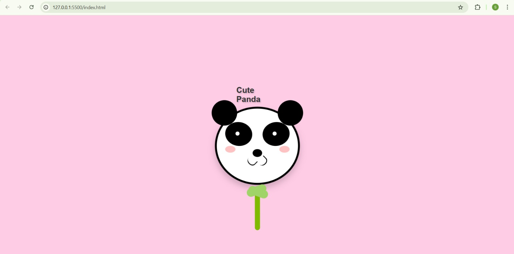

# 🐼 Cute Panda

A charming, animated panda face built with pure HTML and CSS. No JavaScript required!



## Features

- **Pure CSS Animation**: Breathing animation, blinking eyes, and swaying bamboo
- **Interactive Effects**: Hover and click to see the panda scale up
- **Responsive Design**: Centered on the screen with proper viewport scaling
- **No Dependencies**: Lightweight and self-contained

## Demo

Open `index.html` in your browser to see the adorable panda in action!

## How to Run

### Option 1: Direct Browser Open
Simply double-click `index.html` or drag it into your browser.

### Option 2: Live Server (VS Code)
1. Install the **Live Server** extension in VS Code
2. Right-click `index.html` → **Open with Live Server**

### Option 3: Local Server (Python)
```bash
# Python 3
python -m http.server 8000

# Python 2
python -m SimpleHTTPServer 8000
```
Then navigate to `http://localhost:8000`

## Project Structure

```
Panda/
├── index.html      # Main HTML file with embedded CSS
├── index.css       # Empty (styles are inline in HTML)
└── README.md       # This file
```

## Animations

- **Breathing**: The panda face gently scales in and out
- **Blinking**: Eyes blink naturally every 6 seconds
- **Swaying**: Bamboo moves side-to-side smoothly
- **Hover Effect**: Face scales up 5% on hover
- **Click Effect**: Face scales up 10% on click

## Customization

Edit the CSS in `index.html` to customize:

- **Background Color**: Change `background-color: #ffcce6` on the `body`
- **Panda Size**: Adjust `width` and `height` of `.panda-face`
- **Colors**: Modify `background-color` values for different elements
- **Animation Speed**: Change the duration values (e.g., `5s`, `6s`) in `@keyframes`

## Browser Support

Works in all modern browsers that support:
- CSS Flexbox
- CSS Transforms
- CSS Animations
- CSS Border Radius

## License

Free to use and modify!

---

Made with ❤️ and CSS
